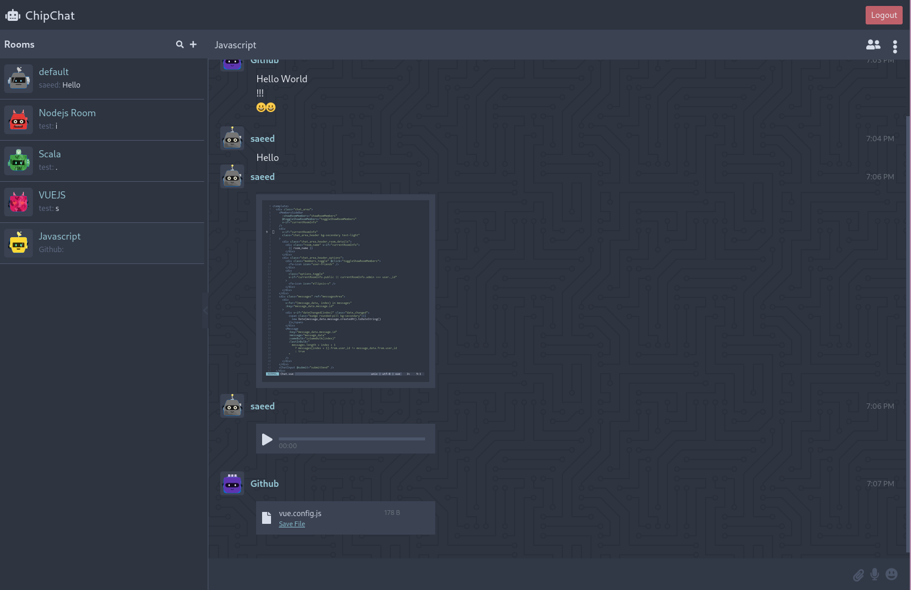

# ChipChat
## Description
This is the frontend of a web based chat application that i built in a short period of time to sharpen my web development skills, I built this app with [VueJS](https://vuejs.org) on the frontend and [NodeJS](https://nodejs.org) on the backend, i tried to keep it as simple as posible.


## Project setup

Clone the repo :
```
git clone https://github.com/saeedvw/chipchat-ui.git
cd chipchat-ui
```
Install packages
```
npm install
```

### Configuration
You need to specify the url for the api server and for the socketio server in the `.env` file, it dependes whcich one to edit corsponding to the build mode. In `.env.example` file it's configured for a local build, but you need to have the api and socketio servers running on the same machine with the default configuration.

### Backend
see [Backend Repo](https://github.com/saeedvw/chipchat-api.git)


### Compiles and hot-reloads for development
```
npm run serve
```

### Compiles and minifies for production
```
npm run build
```

### Lints and fixes files
```
npm run lint
```

### License
Licensed under the GPLv3: http://www.gnu.org/licenses/gpl-3.0.html
